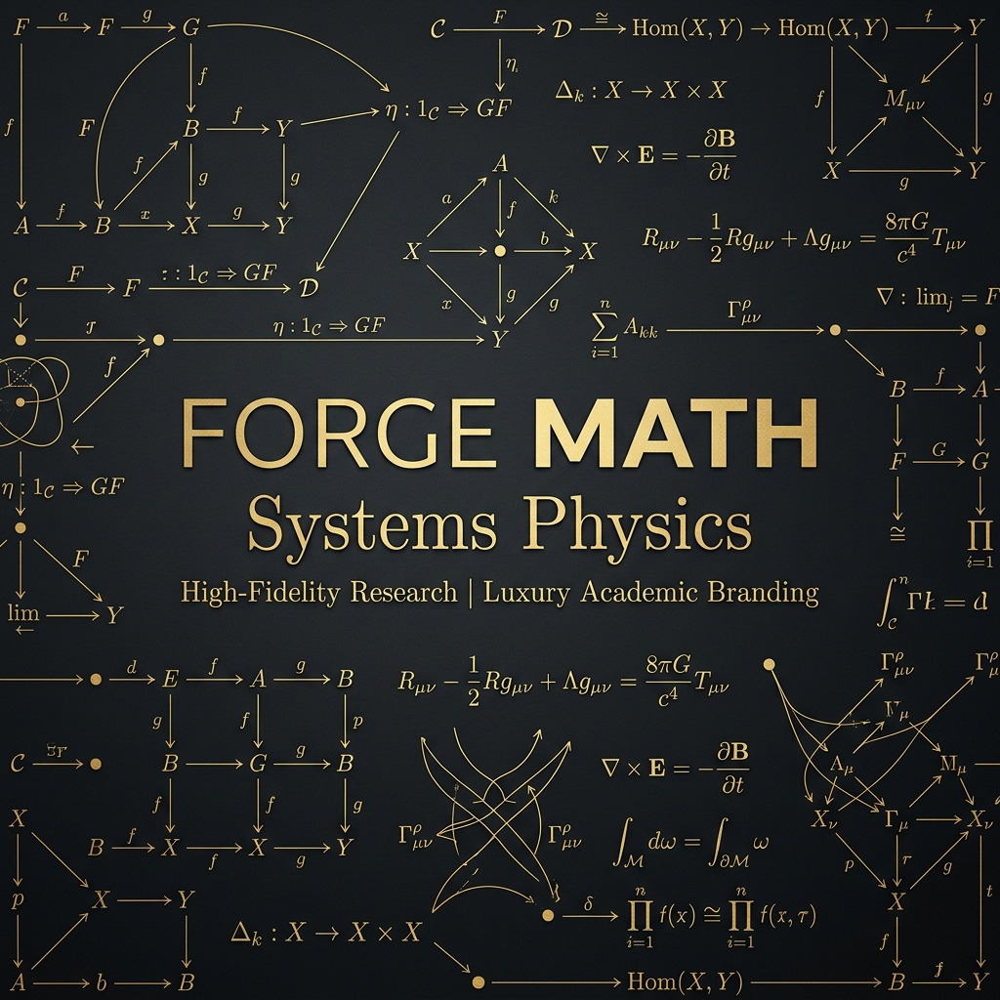

  
  
  <h1>FORGE MATH</h1>
  
<b>Personal Development Mirror</b>

  

    
    
  

---

### ⚠️ Mirror Notice
This is the personal development branch for **Forge Math**. It contains experimental notation and drafting for future versions of the mathematical framework.

**[➡️ Go to Official Repository](https://github.com/DodecaGoneSystems/ForgeMath)**

---

### 🏛️ Underlying Engine
Forge Math maps lived human experience to thermal and physical structures. It provides the "Hardware Metrics" needed to objectively measure cognitive processing resolution and thermal budgets.

### 🌱 Ecosystem
- **Official Hub:** [DodecaGone Systems](https://github.com/DodecaGoneSystems)
- **Writing Standard:** [CR-IMRaD](https://github.com/DodecaGoneSystems/CR-IMRAD)

  <code>><^</code> 
  <i>GNU Terry Pratchett</i>

